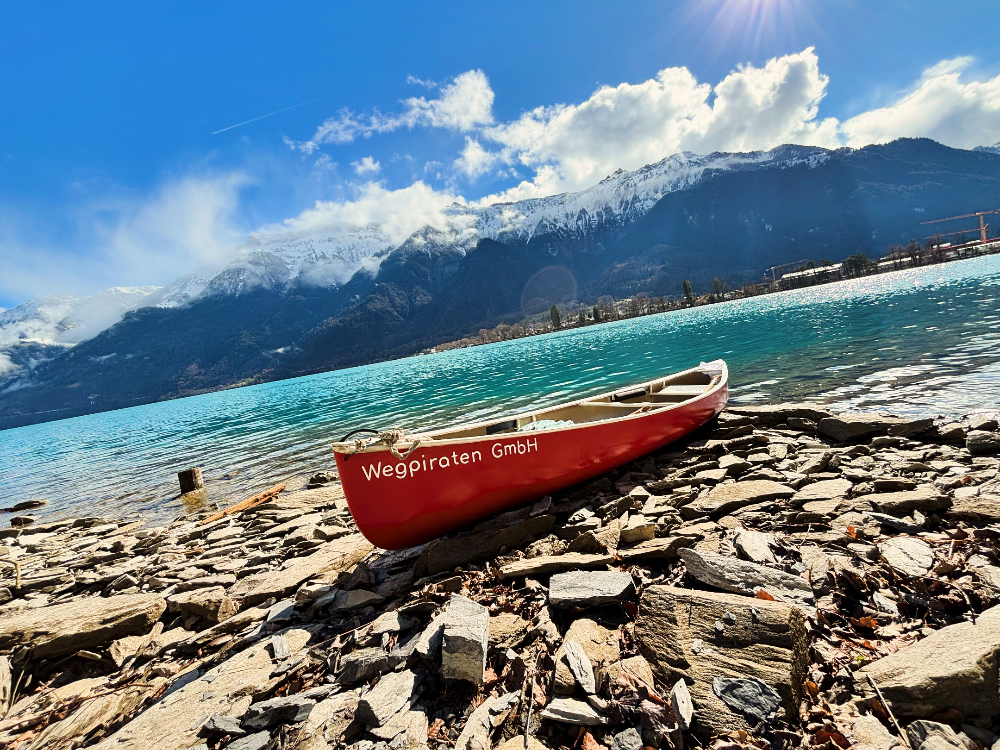
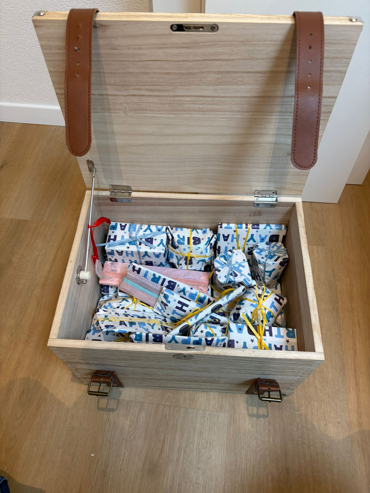
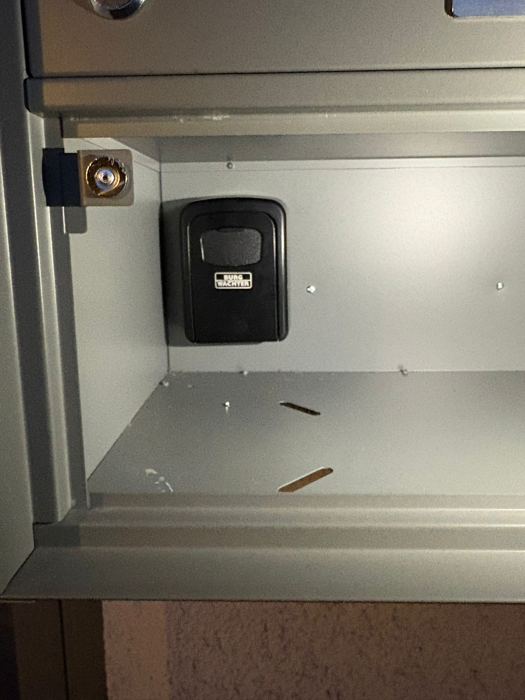
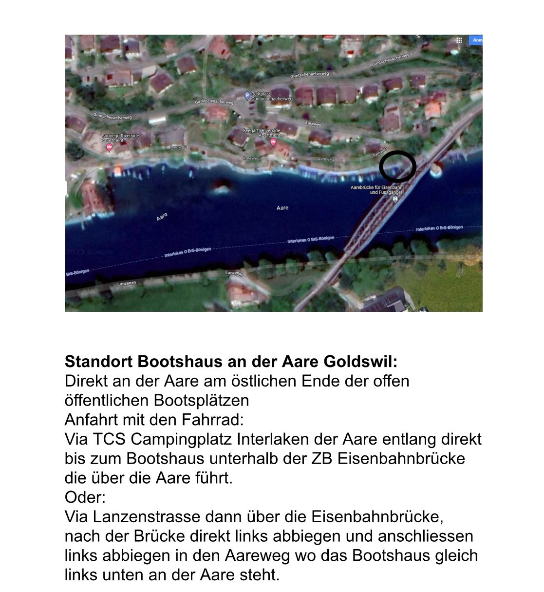
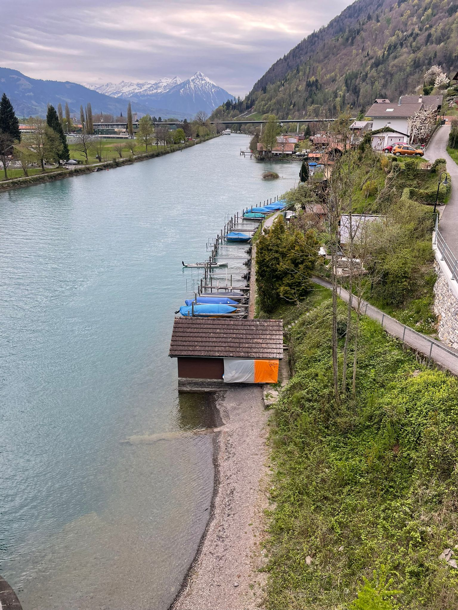
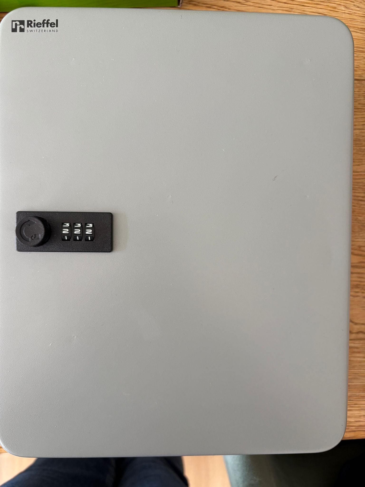

# Ziel und Zweck dieses Readers

Dieses Reglement fasst alle bestehenden Beschlüsse, Richtlinien und Vereinbarungen zusammen, die das Anstellungsverhältnis innerhalb der Wegpiraten GmbH betreffen. Es definiert Rechte und Pflichten, schafft klare Rahmenbedingungen und beschreibt sowohl die Erwartungen an die zu erbringenden Leistungen als auch die gelebte Unternehmenskultur.

Die Bestimmungen gelten für sämtliche Mitarbeitenden der Wegpiraten GmbH. Als rechtliche Hauptgrundlagen dienen das Schweizerische Obligationenrecht (OR), das Arbeitsgesetz (ArG) sowie die entsprechenden Verordnungen (ArGV). Ergänzende Grundlagen bilden der Arbeitsvertrag, der Stellenbeschrieb und interne Weisungen.

Dieses Dokument enthält sensible Informationen, darunter interne Zugangsdaten und vertrauliche betriebliche Inhalte. Bitte entsprechend sorgfältig damit umgehen.

---

# Abschnitt A — Willkommen & Orientierung

## A.1 Wer wir sind

Wir sind die Wegpiraten GmbH — ein multiprofessionelles Team von Sozialpädagoginnen und Sozialpädagogen mit Standorten in Unterseen/Interlaken und Bern. Unsere Arbeit ist systemisch, erlebnispädagogisch und konsequent auf die Menschen ausgerichtet, mit denen wir arbeiten.

Wir begleiten Familien in herausfordernden Lebenssituationen, stärken Erziehungskompetenzen und sichern den Kinderschutz. Dabei sind wir auf Augenhöhe, neugierig und verbindlich.

## A.2 Was wir tun

- Wir kontrollieren die Sicherheit und die altersadäquate Umgebung der Kinder.
- Wir sichern den Kinderschutz ab.
- Wir stärken die Erziehungskompetenzen der Personensorgeberechtigten.
- Wir ermöglichen den Kontakt zwischen Kindern und ihren Eltern.
- Wir erkennen Ressourcen-Schätze und heben sie gemeinsam mit der Familie.
- Wir arbeiten systemisch, interdisziplinär, partizipativ und immer auf Augenhöhe.
- Wir führen Fallakten und schreiben Entwicklungsberichte.
- Wir verlassen uns auf unsere starke multiprofessionelle Crew, die immer hinter uns steht.
- Wir können gut alleine bei und mit den Klienten arbeiten und sind selbstständig.
- Wir sind gerne unterwegs und in Bewegung — Kanu fahren, SUP paddeln, wandern, Fahrradfahren, klettern, segeln, Eislaufen, Schlitteln, Skifahren.
- Wir arbeiten erlebnispädagogisch und bauen Sequenzen zum Explorieren in unsere Arbeit ein.

## A.3 Unsere Grundhaltung

- So wenig wie möglich, so viel wie nötig — Hilfe zur Selbsthilfe.
- Sich selber überflüssig machen.
- Eltern machen es so gut sie können.
- Wir sensibilisieren auf die Lösung, nicht auf das Problem.
- Zukunftsfokus.
- Konsequente Umsetzung der Abmachungen — auch wenn es mal ungemütlich wird.
- Ich bin verbindlich und verlässlich und erwarte das auch vom Gegenüber.
- Ich arbeite ressourcenorientiert.
- Systemischer Grundsatz: alle Player werden involviert.
- Allparteilichkeit — ich schlage mich auf keine Seite.
- Bekräftigen von schönen Momenten und positiven Einstellungen.
- Positive Grundhaltung, Wertschätzung, Menschenfreude.
- Es darf auch gelacht werden.
- Authentisch sein — auch mal sagen, wenn etwas gerade schwierig ist.
- Die Familie ist Expertin für ihre eigenen Themen.
- Jedes Mal wieder eine neue Chance offerieren.
- Ich will mit meinem Dasein etwas bewegen.
- In die Handlung gehen mit ihnen.
- Agieren auf Augenhöhe.
- Begleiten, nicht Erziehen.
- Gesunde Abgrenzung, Rituale beim Begrüssen und Verabschieden.
- Kommunikation der aktuellen Situation.
- Nachnähren mit Erlebnissen, die noch keinen Platz hatten.
- Innovative Ideen in die Familie bringen.
- Wir repräsentieren das Gesetz, wir haben einen Auftrag zu erfüllen — Transparenz der Tatsachen.

Dabei lassen wir die Schuldfrage aussen vor und halten uns an folgende drei Punkte:

1. **Beobachten.**
2. **Rahmenbedingungen stecken.**
3. **Nicht Urteilen.**

## A.4 Das bringst du mit — Passt du in unsere Crew?

- Abgeschlossenes Studium, bevorzugt in Pädagogik, Sozialpädagogik, Sozialer Arbeit oder Kindheitspädagogik.
- Eigenständiges Betreuen der anvertrauten Klienten mit lückenloser Dokumentation.
- Belastbarkeit, Freude an der Arbeit, Prioritäten setzen können.
- Interesse, sich im Bereich Abenteuer- und Erlebnispädagogik weiterzuentwickeln.
- Spielideen und Methoden für die systemische Familienarbeit.
- Versierter Umgang mit Office- und iOS-Programmen sowie digitalen Medien.
- Selbstständiges Arbeiten, Professionalität und Flexibilität.
- Absolute Zuverlässigkeit und Pünktlichkeit, humorvoll, ehrlich, engagiert.
- Das Herz sitzt bei dir am richtigen Fleck — du bist jemand, den du selbst gerne treffen würdest.

Dann: **Willkommen an Bord in Unterseen oder Bern!**

## A.5 Was du von uns erwarten kannst

- Nutzung sämtlicher Materialien und Arbeitsmittel der Wegpiraten GmbH.
- Arbeitsplätze an zentraler Lage in Unterseen/Interlaken oder Bern.
- Individuell gestaltbare Arbeitszeitmodelle ab einem Pensum von 30%.
- Fort- und Weiterbildungsmöglichkeiten sowie gemeinsame Teamtage.
- Partizipative Teamkultur mit aktiver Einbindung eigener Ideen und Mitgestaltungsmöglichkeiten.
- Ein multiprofessionelles Team mit kollegialer Zusammenarbeit und gegenseitiger Unterstützung.
- Klar strukturierte Einsätze, transparente Organisation und verlässliche Kommunikation.
- Regelmässige pädagogische Begleitung — unter anderem in Form von Monatsgesprächen.
- Etablierte Feedback-Kultur und eine lösungsorientierte Haltung im Umgang mit Fehlern.
- Kontinuierliche Weiterentwicklung des pädagogischen Methodenpools, insbesondere in der Abenteuer- und Erlebnispädagogik.
- Gute Vernetzung mit relevanten regionalen Akteurinnen und Akteuren sowie Kooperationspartnern.
- Regelmässige Teamsitzungen und Supervisionen.
- Bei einem 100%-Pensum: 30 Urlaubstage pro Jahr bei einer 40-Stunden-Woche.
- Zusätzliche betriebliche «Hafentage» zwischen den Feiertagen im Dezember.

---

# Abschnitt B — Anstellungsverhältnis

## B.1 Form und Dauer

Die Mitarbeiterin bzw. der Mitarbeiter wird als Sozialpädagogin bzw. Sozialpädagoge angestellt und arbeitet im sozialpädagogischen Bereich der Wegpiraten GmbH, insbesondere in der Sozialpädagogischen Familienbegleitung (SPF) sowie in der Unterstützung bei der Wahrnehmung des Besuchsrechts.

Der hauptsächliche Arbeitsort ist in den Büroräumlichkeiten der Wegpiraten GmbH an der Hauptstrasse 47, 3800 Unterseen, oder an der Maulbeerstrasse 10, 3011 Bern. Zusätzlich werden Einsätze im Sozialraum der Klientinnen und Klienten durchgeführt. Die Mitarbeiterin bzw. der Mitarbeiter ist direkt der Geschäftsführung der Wegpiraten GmbH unterstellt.

Das Arbeitsverhältnis wird durch einen schriftlichen Einzelarbeitsvertrag im Sinne von Art. 319 ff. OR begründet. Ohne besondere Vereinbarung wird der Arbeitsvertrag auf unbestimmte Dauer abgeschlossen.

## B.2 Probezeit

Die ersten drei Monate eines unbefristeten Arbeitsverhältnisses gelten als Probezeit. Nach deren Ablauf gilt das Arbeitsverhältnis weiterhin als unbefristet.

## B.3 Kündigungsfristen

Das Arbeitsverhältnis kann ordentlich und schriftlich wie folgt gekündigt werden:

- **In den ersten zwei Dienstjahren:** Kündigungsfrist von 2 Monaten
- **Ab dem dritten Dienstjahr:** Kündigungsfrist von 3 Monaten

Die Kündigung erfolgt jeweils schriftlich auf das Ende eines Kalendermonats.

Für die Beendigung aufgrund des Erreichens der Altersgrenze oder verminderter Erwerbstätigkeit gelten die gesetzlichen Bestimmungen. Vorbehalten bleibt die fristlose Kündigung aus wichtigen Gründen. Eine sofortige Kündigung ist insbesondere möglich, wenn eine rechtskräftige Verurteilung wegen einer Straftat vorliegt. Das Arbeitsverhältnis endet automatisch per Ende des Monats, in dem das ordentliche AHV-Alter erreicht wird.

## B.4 Lohn

Dem Jahresgehalt liegt ein Stundenlohn von brutto CHF 43.— (**Stand 01.01.2026**) zugrunde, inkl. 3% Feiertagszuschlag und 8,3% Ferienentschädigung.

Die akzeptierten Leistungen sowie nachgewiesene und bewilligte Spesen werden monatlich vergütet. Die Mitarbeitenden verpflichten sich, jeweils bis Ende des Monats für den vergangenen Monat eine Auflistung der Stunden (Arbeitszeitnachweis) zu erstellen und einzureichen — sowohl bei der Buchhaltung (buchhaltung@wegpiraten.ch) als auch bei Frau Wloka (info@wegpiraten.ch).

### Dreizehnter Monatslohn

Der 13. Monatslohn wird, wenn nicht anders vereinbart, jeweils per Ende Jahr ausbezahlt. Bei einem Austritt unter dem Jahr wird er anteilsmässig berechnet und mit dem definitiven Austritt ausbezahlt.

## B.5 Urlaub und Hafentage

Bei einer 100%-Anstellung besteht Anspruch auf 30 bezahlte Urlaubstage pro Jahr (40-Stunden-Woche).

Die zeitliche Lage des Urlaubs wird in Abstimmung mit dem Arbeitgeber schriftlich in einem Formular festgelegt und ist erst mit Genehmigung und nach Unterschrift gültig.

Die Arbeitnehmenden müssen ihren Urlaub nehmen, spätestens bis drei Monate nach Ablauf des betreffenden Kalenderjahres. Es können maximal 10 Urlaubstage in das neue Jahr übertragen werden, die im ersten Quartal des neuen Jahres zu beziehen sind. Ausnahmen werden nur im Zusammenhang mit Weiterbildungen und in Absprache mit der Leitung oder der Geschäftsführerin bewilligt.

Erkrankt eine Mitarbeiterin bzw. ein Mitarbeiter während des Urlaubs, werden die Urlaubstage (ohne Wochenenden) nachgewährt, wenn ein ärztliches Zeugnis vorgelegt wird. Sonderurlaub ohne Gesamtvergütung kann bei wichtigem Grund und wenn die betrieblichen Verhältnisse es gestatten gewährt werden.

Urlaub ist selbstständig im digitalen Kalender einzutragen. Eine Abwesenheitsnotiz im E-Mail-Programm ist eigenständig zu schalten und nach Rückkehr wieder zu entfernen.

### Urlaubstageberechnung

| Pensum | Urlaubstage | Stunden/Tag | Urlaubsstunden/Jahr |
|--------|-------------|-------------|---------------------|
| 100%   | 30 Tage     | 8,0 h       | 240 h               |
| 80%    | 30 Tage     | 6,4 h       | 192 h               |
| 60%    | 30 Tage     | 4,8 h       | 144 h               |

Grundsätzlich werden für die Buchhaltung die Arbeitsstunden prozentual herabgesetzt, nicht die Wochentage verkürzt.

### Dienstfreie Tage (Feiertage)

- 1. Januar (Neujahr)
- 2. Januar
- Karfreitag
- Ostermontag
- Auffahrt
- Pfingstmontag
- 1. August
- 24. Dezember bis 2. Januar (Weihnachten)
- **Wegpiraten BONUS — Hafentage:** 27.12. bis 31.12.

### Bezahlte Sonderfreitage

| Anlass | Freitage |
|--------|----------|
| Eigene Hochzeit | 2 Tage |
| Hochzeit naher Verwandter | 1 Tag |
| Tod innerhalb der Familie (1. Grad) | 2 Tage |
| Tod naher Verwandter (Tante, Onkel u. a.) | 1 Tag |
| Wohnungswechsel / Umzugstag | 1 Tag |

## B.6 Überstunden

Überstunden sind unverzüglich zu melden. Sie werden ohne Zuschlag durch Freizeit kompensiert und grundsätzlich nicht ausbezahlt. Allfällig geleistete Überstunden sind innert eines Jahres durch Freizeit gleicher Dauer zu kompensieren. Sollte dies aus unvorhergesehenen Umständen nicht möglich sein, kann nach vorheriger Rücksprache ausnahmsweise eine Auszahlung zum Stundensatz ohne Zuschlag (1:1) vereinbart werden. Bei Austritt erfolgt eine Auszahlung ohne Zuschlag, sofern eine Kompensation nicht möglich war.

Für Kadermitarbeitende gilt: Ein angemessenes Mass an Mehrleistung ist im Lohn inbegriffen und wird nicht gesondert entschädigt.

## B.7 Weiterbildung

Nach Absprache mit der Geschäftsleitung können Beiträge an Aus-, Weiter- oder Fortbildungen genehmigt werden (siehe auch Arbeitsvertrag). Pro Jahr stehen 5 Weiterbildungstage zur Verfügung. Nicht genutzte Tage verfallen am Jahresende.

## B.8 Arztzeugnis und Krankheit

Bei Arbeitsunfähigkeit von mehr als 3 Tagen ist unaufgefordert und unverzüglich ein Arztzeugnis einzureichen. Wird dies unterlassen, kann der ausgerichtete Lohn gekürzt werden. Bei Absenzen von weniger als 3 Tagen kann ebenfalls ein Arztzeugnis verlangt werden, wenn berechtigte Zweifel bestehen. In jedem Fall einer Dienstaussetzung ist die direkte Vorgesetzte bzw. der direkte Vorgesetzte unmittelbar zu informieren.

## B.9 Mutterschafts- und Vaterschaftsurlaub

Mitarbeiterinnen haben Anspruch auf einen Mutterschaftsurlaub von 14 Wochen (98 Tagen), der am Stück zu nehmen ist. Der Anspruch beginnt am Tag der Geburt. Bei längerem Spitalaufenthalt des Kindes kann die Verschiebung beantragt werden. Bei Totgeburt oder Tod bei der Geburt besteht der Anspruch auf Mutterschaftsentschädigung, wenn die Schwangerschaft mindestens 23 vollständige Wochen gedauert hat.

## B.10 Versicherungen

### Sozialbeiträge und Auszahlung

Von den Salärzahlungen kommen die Prämien der gesetzlich vorgeschriebenen Sozialversicherungen (AHV/IV/EO/ALV) sowie allfällige Zusatzversicherungen oder die Quellensteuer in Abzug. AHV/ALV und Pensionskasse werden nach gesetzlichen Richtlinien abgerechnet. Die monatlichen Salärzahlungen werden spätestens am Ende des Monats bargeldlos überwiesen.

### Pensionskasse

Die Wegpiraten GmbH versichert das Personal gegen die wirtschaftlichen Folgen der Invalidität und des Alters im Rahmen des BVG. Der Versicherer ist Noventus Pensionskassen.

### Kranken- und Unfallversicherung

**A.** Betriebs- und Nichtbetriebsunfallversicherung (NBUV) bei der Helsana, zu Lasten der Wegpiraten GmbH gemäss UVG.

**B.** Krankentagegeldversicherung bei der Mobiliar mit 30 Tagen Wartefrist. Die Prämien gehen je zur Hälfte zu Lasten der Mitarbeitenden.

## B.11 Schweigepflicht

Mitarbeitende unterstehen der beruflichen Schweigepflicht. Es ist untersagt, Informationen über Kinder, Jugendliche oder deren Angehörige, die im Rahmen der beruflichen Tätigkeit erlangt werden, sowohl während als auch nach Beendigung des Arbeitsverhältnisses an unbefugte Dritte weiterzugeben.

Akten und vertrauliche Unterlagen dürfen ohne Zustimmung der vorgesetzten Stelle grundsätzlich keiner Person zugänglich gemacht werden — auch nicht den betroffenen Kindern oder Jugendlichen. Die Verletzung des Berufsgeheimnisses ist gemäss Art. 321 StGB strafbar.

Die Schweigepflicht entfällt, wenn die gesetzliche Vertretung des Kindes eine ausdrückliche Auskunftsermächtigung erteilt oder wenn eine gesetzliche Offenlegungspflicht besteht. Besteht der begründete Verdacht, dass die körperliche oder seelische Integrität eines Kindes gefährdet ist, besteht eine unverzügliche Informationspflicht gegenüber der vorgesetzten Stelle.

---

# Abschnitt C — Arbeiten bei den Wegpiraten

## C.1 Stellenbeschreibung

Die sozialpädagogische Arbeit basiert auf der Leistungsbeschreibung «Sozialpädagogische Familienbegleitung» in der Fassung vom 05.10.2022 sowie auf den Leistungsvereinbarungen des Bereichs «Unterstützung bei der Wahrnehmung des Besuchsrechts».

Die pädagogischen Konzeptionen beider Leistungsbereiche bilden die verbindliche fachliche Grundlage. Art, Ziel und Umfang der Unterstützungsleistungen ergeben sich aus dem Gesetz über die Leistungen für Kinder mit besonderem Förder- und Schutzbedarf (KFSG) vom 03.12.2020. Übergeordnetes Ziel ist die Förderung der Beziehung des jungen Menschen zu seiner Herkunftsfamilie.

Die Tätigkeit der Mitarbeitenden erfolgt überwiegend im häuslichen Umfeld der Familien, im Sozialraum sowie in den Räumlichkeiten der Wegpiraten GmbH. Die Arbeit wird im Rahmen der ambulanten Familienbegleitung weitgehend selbständig ausgeführt.

Der Aufgabenbereich umfasst insbesondere:

- Elterncoaching und Unterstützung in Erziehungsfragen
- Einzelbegleitungen
- Abklärungen im Rahmen des Kinderschutzes
- Begleitungen im Rahmen des Besuchsrechts
- Unterstützung bei der Strukturierung des Familienalltags
- Förderung stabiler Beziehungen innerhalb des Familiensystems
- Aktivierung und Erschliessung informeller und materieller Ressourcen (z. B. Transferleistungen)

## C.2 Arbeitszeitnachweis und Stundenerfassung

Für die Zeitabrechnung werden folgende Anteile erfasst:

- Direktkontakt
- Fahrzeit
- Indirekte Fallarbeit

Die Zeiterfassung erfolgt gemäss dem effektiven Aufwand, gerundet auf 5 Minuten. Intern sind die Tätigkeiten detailliert festzuhalten. Das Kantonale Jugendamt (KJA) kann die interne detaillierte Zeiterfassung bei den Leistungserbringenden einfordern.

**Zu deklarieren:**

- Direktkontakt mit der Familie
- Fallbezogene Arbeit
- Wegzeit

### Überblick Leistungen und Abgeltung

| Nr. | Leistung | Bemerkungen | Abgeltung |
|-----|----------|-------------|-----------|
| 1 | Sozialpädagogische Familienbegleitung (SPF) | Wegzeit und indirekte Fallarbeit werden abgegolten. | Pro Stunde, im 5-Minuten-Takt (Direktkontakt, indirekte Fallarbeit, Fahrtzeit) |
| 2 | UWB Ausübung Gruppe | Keine Abgeltung von Fahrzeit oder indirekter Fallarbeit. | Pro Stunde |
| 3 | UWB Übergabe Gruppe | Keine Abgeltung von Fahrzeit oder indirekter Fallarbeit. Pro Besuch (Übergabe und Übernahme). | Pro Stunde |
| 4 | UWB Begleitung individuell | Wegzeit und indirekte Fallarbeit werden abgegolten. Direktkontakt max. 10 Stunden. Besondere Begründung bei der Behörde erforderlich. | Pro Stunde |
| 5 | DAF (Langzeitunterbringung Familienpflege) | Wegzeit und indirekte Fallarbeit werden abgegolten. | Pro Stunde, im 5-Minuten-Takt |

### Sozialpädagogische Familienbegleitung (SPF) — Detailregeln

Abgerechnet wird in Direktkontakt, indirekte Fallbearbeitung und Fahrtzeit. Die Stunden der indirekten fallbezogenen Arbeit dürfen bei Leistungsende 50% der geleisteten Stunden im Direktkontakt nicht überschreiten. Das heisst: Für jede Stunde im Direktkontakt mit der Familie kann höchstens eine halbe Stunde für die indirekte fallbezogene fachliche Arbeit verrechnet werden.

Die 50%-Regelung gilt nicht bei ungeplanten Abbrüchen (einseitiger Entscheid) während der ersten drei Monate und bei indizierten Kurzeinsätzen bis zu drei Monaten.

### Übersicht Tätigkeitskategorien

**Direktkontakt mit der Familie:**

- Begleitung der Familie
- Vor- oder Nachbesprechungen mit den Eltern
- Beratung von Eltern (telefonisch, E-Mail, WhatsApp)

**Indirekte fallbezogene fachliche Arbeit:**

- Vor- und Nachbereitung inkl. Verfassen von Berichten und Aktennotizen
- Kontakt mit Leistungsbestellenden, Fallbesprechungen, Fallsupervision
- Fallbezogene Arbeit mit dem sozialen Netzwerk
- Fachliche fallübergreifende Aufwände (z. B. Supervision, Teamsitzung)

**Fahrtzeit:**

- Hin- und Rückweg zu den Familien (Tür zu Tür)

### Sonntags- und Abendarbeit

Im Grundsatz sind in der Zeit zwischen Samstag 23 Uhr und Sonntag 23 Uhr sowie generell nach 20 Uhr keine Einsätze vorgesehen. In Ausnahmefällen können die Leistungsbesteller mit Begründung von dieser Regelung absehen. Es werden keine Zuschläge vergütet.

### Spezialfälle

- Die Dolmetschkosten gehen zu Lasten des KJA Bern.
- Von den Betroffenen nicht eingehaltene Termine und Absagen, die weniger als 24 Stunden vor dem vereinbarten Einsatz erfolgen, können ohne die entsprechende Wegzeit auf dem Arbeitszeitnachweis deklariert werden.

## C.3 Spesen

Quittungen und Rechnungen (im Original) sind mit dem Namenskürzel der Klientin/des Klienten und einer kurzen Beschreibung des Verwendungszwecks zu versehen (z. B. «Klient:in HaWu — Zvieri»).

Sie sind zusammen mit der Spesentasche fristgerecht zum Monatsende ans Büro in Unterseen einzureichen. Oben auf dem Abrechnungsblatt stehen Name der Fachperson und Abrechnungsmonat mit Jahreszahl — dies gilt für jedes Abrechnungsblatt.

Die Quittungen werden auf ein DIN-A4-Blatt geklebt (ohne zu überlappen). Betrag in CHF und Datum sind mit einem auffälligen Marker zu unterstreichen.

Spesen werden monatlich separat ausbezahlt. Bei Bedarf kann ein Spesenvorschuss bei der Geschäftsführung beantragt werden.

## C.4 Stundenerhöhung pro Monat

Sollte das Stundenkontingent bei den Klienten für einen Monat nicht ausreichen, so ist die sozialpädagogische Fachperson im Voraus darüber zu informieren. Mehrstunden müssen schriftlich bei der zuständigen Fachperson im Amt oder der Behörde beantragt und ausdrücklich schriftlich genehmigt werden.

## C.5 Entwicklungsberichte

Entwicklungsberichte sind immer bis zum angegebenen Datum bei der Leitung einzureichen. Sie werden mithilfe eines externen Lektors und KI korrigiert und dann von Frau Wloka versendet. Die Mitarbeiterin bzw. der Mitarbeiter wird in der versendeten E-Mail an den Leistungsbesteller in CC gesetzt und erhält dadurch Kenntnis, wann der Bericht versendet wurde. Eigenständig, ohne Genehmigung, werden keine Entwicklungsberichte vom Personal versendet.

### Aufbau und Schreibweise

- Schreiben im Präsens/Gegenwartsform (z. B. «Ich laufe»)
- Datum: 05.04.2023
- Uhrzeit: 10:00 Uhr
- *«Wörtliche Rede»* kennzeichnen (kursiv)
- Ganze Sätze mit Der, Die, Das
- Abkürzungen: KM, KV, KE (Kindesmutter, Kindesvater, Kindeseltern)
- Namen der Klienten werden ausgeschrieben (z. B. Max, Franz, Heidi)
- STAO (das Standortgespräch) — nicht «eine STAO»
- Bei einer Aufzählung kein Punkt am Ende
- Es heisst «beim Sozialdienst XY» oder «im Sozialdienst XY» (nicht «auf dem Sozialdienst»)

### Gliederung des Entwicklungsberichts

1. **Aktuelle Situation, Ausgangslage, Auftrag und Ziele:** Darstellung der familiären Ausgangslage, Anlass der Massnahme und Zielsetzung.
2. **Familiensituation:** Wohnsituation, Rollenverteilung, Kooperation der Eltern, Belastungen und Ressourcen.
3. **Entwicklung und Wohl des Kindes:** Emotionales, soziales, kognitives und körperliches Wohlbefinden.
4. **Bindung und Beziehungsgestaltung:** Bindungsqualität und Interaktion zwischen Kind und Bezugspersonen.
5. **Gesundheit und Versorgung:** Körperliche und psychische Gesundheit, medizinische Versorgung, therapeutische Anbindung.
6. **Schutzfaktoren und Risikofaktoren:** Relevante Schutz- und Risikofaktoren in Bezug auf das Kindeswohl.
7. **Einschätzung des Kindeswohls:** Fachliche Gesamteinschätzung.
8. **Verlauf der Massnahme:** Bisherige Zusammenarbeit, umgesetzte Massnahmen und deren Wirkung.
9. **Fachliche Einschätzung:** Zusammenfassende sozialpädagogische Beurteilung.
10. **Perspektiv- und Handlungsempfehlung:** Empfehlung zur weiteren Perspektive und Ausgestaltung zukünftiger Massnahmen.
11. **Ausblick und Schlussbemerkung:** Hinweis auf Grenzen der Einschätzung und abschliessende Bemerkungen.

## C.6 Verhaltensregeln

Die folgenden Verhaltensgrundsätze sind verbindlich. Sie dienen der Sicherstellung eines professionellen, respektvollen und sicheren Arbeitsumfelds sowie der Wahrung der Vorbildfunktion gegenüber Kindern, Jugendlichen und deren Familien.

Alle Mitarbeitenden sollen sich einander gegenüber rücksichtsvoll verhalten und die persönlichen Sphären gegenseitig respektieren. Bei Mobbing, Bossing, Diskriminierung oder sexueller Belästigung gilt: die belästigende Person auf das unzulässige Verhalten hinweisen, die betroffene Person unterstützen. Vorgesetzte sind in ihrem Zuständigkeitsbereich für eine diskriminierungs- und belästigungsfreie Arbeitsatmosphäre verantwortlich.

**1. Körpersprache und Sitzhaltung**

- Eine aufrechte und professionelle Körperhaltung ist einzuhalten.
- Sitzhaltungen, die als unangemessen oder zu privat wahrgenommen werden können (z. B. Schneidersitz), sind zu vermeiden.

**2. Umgang mit Mobiltelefonen**

- Private Telefonate oder Nachrichten während Kontaktsituationen sind zu unterlassen.
- Diensthandys sind während Einsätzen lautlos zu stellen und nur für fachlich notwendige Zwecke zu nutzen.

**3. Diensttelefon — Sorgfalt und Meldepflicht**

- Diensthandys sind sorgfältig zu behandeln und vor Beschädigung, Verlust oder Diebstahl zu schützen.
- Schäden, Funktionsstörungen oder Verlust sind unverzüglich der vorgesetzten Stelle zu melden.

**4. Essen und Trinken im Arbeitskontext**

- Essen während Gesprächen oder Einsätzen ist zu vermeiden, ausser es ist pädagogisch begründet oder Teil des Auftrags.
- Getränke sind zulässig, sofern situativ angemessen.

**5. Pünktlichkeit und Zuverlässigkeit**

- Termine und Absprachen sind pünktlich einzuhalten.
- Bei Verzögerungen erfolgt eine rechtzeitige Information an Klientinnen und Klienten sowie die vorgesetzte Stelle.

**6. Professioneller Abstand**

- Die berufliche Rolle ist jederzeit zu wahren.
- Übermässige private Offenbarungen sind zu vermeiden.
- Körperkontakt zu Klientinnen und Klienten erfolgt nur, wenn fachlich begründet und verantwortbar.

**7. Sprache und Kommunikation**

- Mitarbeitende verwenden eine respektvolle, klare und sachliche Ausdrucksweise.
- Abwertende, ironische, sexualisierte oder politisch aufgeladene Aussagen sind zu unterlassen.
- Dialekt ist zulässig, sofern die Verständlichkeit gewährleistet bleibt.

**8. Hygiene und Erscheinungsbild**

- Ein gepflegtes Erscheinungsbild ist jederzeit sicherzustellen.
- Stark riechende Parfums oder Duftstoffe sind zu vermeiden.

**9. Rauch- und Suchtmittelkonsum**

- Der Konsum von Alkohol, Cannabis oder anderen Substanzen vor oder während der Arbeitszeit ist strengstens verboten.

**10. Umgang mit privatem Eigentum der Klienten**

- Persönliche Gegenstände und Möbel der Klienten sind respektvoll zu behandeln.
- Das Betreten von Räumen erfolgt ausschliesslich mit Einverständnis der Klientinnen und Klienten.

**11. Verhalten im häuslichen Umfeld**

- Schuhe werden nur ausgezogen, wenn dies im Haushalt üblich oder hygienisch notwendig ist.
- Eine Teilnahme an privaten familiären Aktivitäten (z. B. gemeinsame Mahlzeiten) erfolgt nur, wenn pädagogisch begründet und mit der vorgesetzten Stelle abgesprochen.

## C.7 Dresscode

Mitarbeitende vertreten die Wegpiraten GmbH nach innen und aussen. Ein gepflegtes, professionelles und situationsangemessenes Erscheinungsbild ist daher zwingend. Die Kleidung soll sowohl den Anforderungen der pädagogischen Arbeit als auch dem Schutz der Privatsphäre und der Vorbildfunktion gegenüber Kindern, Jugendlichen und Familien entsprechen.

**Angemessenheit und Professionalität:**

- Die Kleidung muss gepflegt, sauber und alltags- sowie einsatzgerecht sein.
- Ein neutraler, zurückhaltender Stil (Casual Chic) wird erwartet.

**Nicht zulässig:**

- Bauchfreie oder stark freizügige Kleidung
- Kleidung mit übermässig tiefem Ausschnitt
- Jogginghosen oder vergleichbare Freizeitbekleidung, sofern nicht ausdrücklich durch den Einsatz gerechtfertigt
- Kleidung mit diskriminierenden, beleidigenden, sexualisierten oder politisch motivierten Aufdrucken oder Symbolen
- Stark aufreizende oder unangemessen figurbetonte Kleidung

**Funktionalität und Sicherheit:**

- Die Kleidung soll eine sichere, bewegungsfreundliche und professionelle Durchführung der Arbeit ermöglichen.
- Schuhe müssen zweckmässig und für Hausbesuche sowie Einsätze im Sozialraum geeignet sein.

**Vorbildfunktion:**

- Die Mitarbeitenden agieren als Bezugspersonen und Vorbilder.
- Das Erscheinungsbild soll diese Rolle unterstützen und der Zielgruppe ein Gefühl von Respekt, Sicherheit und Professionalität vermitteln.
- Die vorgesetzte Stelle kann situative Anpassungen oder zusätzliche Hinweise zum Dresscode geben, insbesondere bei repräsentativen Anlässen.

## C.8 Diensthandy

Das von den Wegpiraten zur Verfügung gestellte Diensthandy verfügt über 5 GB oder 10 GB und ist ausschliesslich in der Schweiz zu nutzen. Anrufe, SMS und das Internet innerhalb der Schweiz sind kostenlos. Das Diensthandy ist **in keinem Fall im Ausland zu benutzen**. Bei Bedarf kann eine Rufweiterleitung an die Leitungen in Bern und Unterseen erfolgen (nach vorheriger Absprache). Nimmt jemand das Handy unerlaubt mit ins Ausland und es fallen Telefongebühren an, zahlt die betreffende Person den Betrag selbst.

---

# Abschnitt D — Organisation und Infrastruktur

## D.1 Standorte

### Büro Unterseen (Hauptstandort)

Hauptstrasse 47, 3800 Unterseen

**Gebäudekontakt:**
STWEG Stedtli-Zentrum Nord, Unterseen
Livta AG, Hauptstrasse 43, 3800 Unterseen
Tel: 033 828 33 33 | E-Mail: info@livta.ch

Direkter Ansprechpartner:
Thomas Schärz, Geschäftsführer
Tel: 033 828 33 32

**W-LAN Unterseen:**
Netzwerkname (SSID): EB8B1003A3
Passwort: Wpira@2025

### Büro Bern

Maulbeerstrasse 10, 3011 Bern

**Gebäudekontakt:**
Projekt Interim Bern GmbH, Maulbeerstrasse 10, 3011 Bern
Tel: +41 31 511 40 99

Ansprechpartner: David Derbin
E-Mail: david.derbin@projekt-interim.ch | Tel: 078 974 40 67

Bewirtschafterin: Elriz Traub
Tel 1: +41 61 511 23 77 | Tel 2: +41 78 647 60 68
E-Mail: elriz.traub@projekt-interim.ch

**W-LAN Bern:**
Netzwerkname: Maulbeerstrasse 10
Passwort: projektinterim

**Transponder Bern:** Um nach 20:00 Uhr in das Gebäude zu gelangen, hängt der Transponder im Schlüsselkasten in Unterseen.

**Sitzungszimmer buchen (Bern):**
https://www.supersaas.de/dashboard/login
Benutzername: MeetingMaulbeerstrasse
Passwort: Maulbeerstrasse10

### Bootshaus Goldswil (Aare)

Direkt an der Aare, am östlichen Ende der öffentlichen Bootsplätze.

**Anfahrt mit dem Fahrrad:**
- Via TCS Campingplatz Interlaken der Aare entlang direkt bis zum Bootshaus unterhalb der ZB Eisenbahnbrücke
- Oder: Via Lanzenstrasse, dann über die Eisenbahnbrücke, nach der Brücke direkt links abbiegen und dann links in den Aareweg, wo das Bootshaus links unten an der Aare steht.

### Bootshaus Brienzersee

Der Schlüssel ist im Schlüsselkasten im Schrank im Büro in Unterseen. Nach der Benutzung ist er dort zurückzubringen. Im digitalen Kalender eintragen, wenn du am Bootshaus bist.

Das Bootshaus darf auch für private Zwecke verwendet werden — ebenfalls im Kalender eintragen. Eigene Familie, Verwandte und Freunde sind herzlich willkommen, die Boote gemeinsam zu nutzen. Die Fachperson der Wegpiraten GmbH muss in jedem Fall dabei sein. **Es herrscht Schwimmwestenpflicht.**

## D.2 Zugänge und Schlüssel

### Schlüsselkasten Unterseen

Im Schlüsselkasten (grau, im weissen Innenschrank im Büro Unterseen) befinden sich alle Schlüssel, die du benötigst: Kanuhaus, Bern, Transponder, Briefkasten usw.

**Code Schlüsselkasten: 222**

### Schlüsseltresor am Briefkasten Unterseen

Am Briefkastenmilchfach befindet sich ein Schlüsseltresor. Der Code wird im WhatsApp-Chat bekanntgegeben. Sobald sich Änderungen ergeben, wird der Code geändert.

### Kindersicherung Steckdosen

Die Steckdosen sind mit Kindersicherungen gesichert. Der Schlüssel zum Öffnen befindet sich in der Schublade des Büroschreibtisches.

## D.3 IT und digitale Infrastruktur

### Computer Apple MacBook Air (Büro Unterseen)

Anmeldung:
- Benutzer: Wegpiraten GmbH (schwarzes Flaggenbild)
- Passwort Computer: Wegpiratengmbh
- E-Mail Adresse: wegpiraten.gmbh@wegpiraten.ch
- Passwort E-Mail: Bürointerlaken4321!
- Apple ID: Buerointerlaken4321!
- Apple ID Passwort: Piratenpower4321! *(Stand 26.11.2024)*

### Digitaler Kalender

Im digitalen Kalender kannst du dich informieren, wann etwas stattfindet. Ausserdem: Büro, Bootshaus u. a. dort reservieren.

- Kalender Unterseen: https://kalender.digital/26e8063b4fea678c5eea
- Kalender Bern: https://kalender.digital/d2fc8b7b8356c2e09b67

### Dolmetscher-Service Comprendi

Über www.comprendi.ch können im Kanton Bern Übersetzerinnen und Übersetzer in jeder Sprache gebucht werden. Nach dem Termin die Unterschrift leisten und bestätigen — die Rechnung geht direkt an die Wegpiraten GmbH und wird vom Kantonalen Jugendamt Bern erstattet. Der Dienst wird von der Caritas Bern angeboten.

Benutzername: wegGmbH\_23
Passwort: wegpirgmbh2

## D.4 Büroalltag

### Materialien und Anschaffungen

Anschaffungswünsche (Material, Bücher u. a.) bitte mit der vorgesetzten Leitung besprechen. Im Büro in Unterseen hängt zudem eine Liste am Kühlschrank, auf der Wünsche notiert werden können.

### Getränke und Essen

Im Büro in Unterseen und Bern sind alle Getränke (Tee, Kaffee, Wasser, Softdrinks u. a.) für die Mitarbeitenden kostenlos. Sollte etwas fehlen: eigenständig besorgen oder an eine Leitungsperson melden.

### Müllentsorgung

Der Müll wird in gebührenpflichtigen Kehrichtsäcken im Innenhof entsorgt (direkt neben dem Parkhaus in Unterseen).

### Reinigung

Alle zwei Wochen werden die Büros feucht gewischt. Jede Person hat den Raum so zu verlassen (oder besser) wie sie ihn vorgefunden hat. Ein Staubsauger steht zur Verfügung — nach jeder Benutzung zu reinigen und an die Stromversorgung anzuschliessen.

### Erste Hilfe

Alle Mitarbeitenden erhalten ein Erste-Hilfe-Set und eine Pflasterbox für unterwegs. Im Raum in Unterseen und Bern existieren ebenfalls grosse Erste-Hilfe-Kästen.

### Dienstfahrräder

Den Mitarbeitenden stehen Dienstfahrräder zur Verfügung. Sie stehen im Keller in Unterseen und sind dort immer wieder abzustellen. Die Fahrradschlösser haben alle den gleichen Code: **22222** (immer die 2).

### Geburtstagsgeschenke für Klienten (Kinder)

Im Büro Unterseen gibt es Grusskarten zum Schreiben in der Schublade des weissen Schranks. Ausserdem eine Kiste mit vorbereiteten Kindergeschenken.

## D.5 Benutzung der Büroräume

Die Räumlichkeiten der Wegpiraten GmbH stehen den Mitarbeitenden zur Verfügung — nach Eintragung in den digitalen Kalender. Bei privater Nutzung ist eine vorherige Absprache mit der Leitung in Unterseen oder Bern notwendig.

## D.6 Postbehandlung und Briefe

Folgende Regelung gilt für das Öffnen von Briefen:

- Alle Briefe an die Firma Wegpiraten GmbH dürfen von befugten Mitarbeitenden (Postbevollmächtigte, Geschäftsführerin, Buchhalterin, stellv. Leitung, Sekretariat u. a.) geöffnet werden.
- Post, die als «persönlich» oder «vertraulich» gekennzeichnet ist, darf nur von der bzw. dem jeweiligen Empfangenden geöffnet werden.
- Wer unbefugt Briefe öffnet, verletzt das Briefgeheimnis und macht sich strafbar.

**Zuordnungsbeispiele:**

1. Firmenname zuerst, dann Personenname → darf geöffnet werden (innerbetriebliche Zuordnung)
2. Personenname zuerst, dann Firmenname → darf geöffnet werden
3. «Vertraulich» oder «persönlich» vermerkt → nur vom Empfangenden zu öffnen

**Briefe an die Geschäftsführung** werden von allen ungeöffnet an Frau Viktoria Wloka weitergeleitet (physisches Dienstfach im Büro).

---

# Anhang — Formulare und Vorlagen

Die folgenden Formulare und Vorlagen sind separate Dokumente und werden bei Bedarf durch die Leitung ausgehändigt oder digital bereitgestellt.

## Anhang 1 — Überblick Termine (Logbuch-Vorlage)

Vorlage zur Terminerfassung im Rahmen von Entwicklungsberichten.

| Datum | Termin stattgefunden | | Bemerkung |
|-------|---------------------|---|-----------|
|       | Ja                  | Nein | |
|       | Ja                  | Nein | |
|       | Ja                  | Nein | |
|       | Ja                  | Nein | |

## Anhang 2 — Entwicklungsbericht (Basisvorlage)

### Basisinformationen

| Leistung | Anbieter |
|----------|----------|
| Sozialpädagogische Familienbegleitung (SPF) | Wegpiraten GmbH |
| DAF (Langzeitunterbringung Familienpflege) | Hauptstrasse 47 |
| UWB Begleitung individuell | 3800 Unterseen |
| UWB Ausübung Gruppe | Tel: 076 790 67 56 |
| UWB Übergabe Gruppe | E-Mail: info@wegpiraten.ch / www.wegpiraten.ch |

| Feld | Inhalt |
|------|--------|
| Leistungsbesteller | |
| Aufnahmegespräch | |
| Berichtszeitraum | bis |
| Sozialarbeiterin Team Kinderschutz | |
| Beistandschaft | Ja / Nein |
| Auftrag und Ziele | |
| Kurznotiz | |

| Bewilligtes Stundenkontingent | |
|-------------------------------|--|
| Direktkontakt | |
| Indirekte Fallbearbeitung | |
| Fahrzeit | |

| Kontaktangaben der Familie | |
|----------------------------|--|
| Name Indexkind | |
| Geburtsdatum | |
| AHV-Nummer | |
| Name Mutter | |
| Name Vater | |
| Sonstiges | |

| Adressen | |
|----------|--|
| Mutter | |
| Vater | |
| Kind lebt bei | |
| Institution | |

| Familienbegleiterin/Familienbegleiter | |
|--------------------------------------|--|
| Name der Fachkraft | Frau / Herr |
| Qualifikation | |

## Anhang 3 — Logbuch Entwicklungsberichte

Das Logbuch dient zur standardisierten Dokumentation von Ressourcen, Stärken, Interessen, persönlichen Wünschen und Zielen. Grundlage für die alle 6 Monate einzureichenden Entwicklungsberichte.

### Grundsätze (Bedürfnisebenen)

| Ebene | Beschreibung |
|-------|-------------|
| Physiologische Bedürfnisse | Schlaf, Essen, Trinken, Wach- und Ruherhythmus, Körperpflege, Gesundheitsfürsorge |
| Schutz und Sicherheit | Aufsicht, wetterangemessene Kleidung, Schutz vor Krankheiten und Bedrohungen |
| Soziale Bedingungen | Verlässlichkeit, konstante Bezugspersonen, einfühlendes Verständnis, Zuwendung |
| Wertschätzung | Respekt vor der physischen, psychischen und sexuellen Unversehrtheit, Anerkennung der Eigenständigkeit |
| Soziale, kognitive, emotionale und ethische Erfahrungen | Altersentsprechende Anregungen, Werte und Normen, Sozialraum, Sprachförderung |

### ICF-Kategorien (Überblick)

Internationale Klassifikation der Funktionsfähigkeit, Beeinträchtigung und Gesundheit für Kinder und Jugendliche. Ziel: ganzheitliche Erfassung der Lebenssituation in einer gemeinsamen Sprache.

- Allgemeines Lernen
- Umgang mit Anforderungen
- Kommunikation
- Spracherwerb und Begriffsbildung
- Bewegung und Mobilität
- Sozial-emotionales Lernen

Weitere Details: https://bildungsportal-niedersachsen.de/fileadmin/3_Fruehkindliche_Bildung/Bildungsauftrag/Orientierungsplan/

## Anhang 4 — Aufnahmegespräch (Aufnahmebogen)

### Personalien der Familie

| Angaben zum Indexkind | |
|----------------------|--|
| Name | |
| Geburtsdatum | |
| Geschlecht | |
| AHV-Nummer | |
| Anzahl Geschwister | |
| Adresse | |
| E-Mail | |
| Telefon | |

| Angaben zur Kindesmutter | |
|--------------------------|--|
| Name | |
| Geburtsdatum | |
| Adresse | |
| E-Mail | |
| Telefon | |

| Angaben zum Kindesvater | |
|-------------------------|--|
| Name | |
| Geburtsdatum | |
| Adresse | |
| E-Mail | |
| Telefon | |

| Geschwister | 1. Kind | 2. Kind | 3. Kind |
|-------------|---------|---------|---------|
| Name | | | |
| Geburtsdatum | | | |
| Adresse | | | |

### Grund für die ambulante sozialpädagogische Familienbegleitung

(Zutreffendes bitte ankreuzen und erläutern)

- [ ] Erziehungsprobleme, familiäre Situation:
- [ ] Fehlendes soziales Netz; Isolation:
- [ ] Gewalt, Misshandlung, Vernachlässigung der Kinder:
- [ ] Beeinträchtigungen, Krankheit des Kindes:
- [ ] Verhaltensauffälligkeiten Kinder:
- [ ] Elternkonflikte:
- [ ] Andere Gründe, welche:

### Ressourcen

| Kind/Jugendliche/r | |
|-------------------|--|
| Vorhandene Ressourcen | |
| Fehlende Ressourcen | |

| Kindeseltern | |
|-------------|--|
| Vorhandene Ressourcen | |
| Fehlende Ressourcen | |

| Familie & Umfeld | |
|-----------------|--|
| Vorhandene Ressourcen | |
| Fehlende Ressourcen | |

| Schule & Ausbildung | |
|--------------------|--|
| Vorhandene Ressourcen | |
| Fehlende Ressourcen | |

### Bisherige Massnahmen

| Massnahmen | |
|-----------|--|
| Abklärungen | |
| Ergebnisse | |
| Diagnosen | |
| Unterstützungsangebote | |

### Multiprofessionelle Zusammenarbeit

| Institution | |
|------------|--|
| Kindertagesbetreuung/Spielgruppe | |
| Schule | |
| Schulsozialarbeit | |
| Mütter-/Väterberatung | |
| Entlastungsdienst (SRK, Pro Infirmis u. a.) | |
| Heilpädagogische Früherziehung | |
| Schulische Beratungsdienste | |
| Psychotherapie | |
| Andere Helfernetzwerke | |

### Auftrag und Ziele

| Auftrag und Ziele | |
|------------------|--|
| | |
| | |

### Planung Stundenkontingent

| Stundenumfang | Direktkontakt | Indirekte Fallbearbeitung | Fahrtzeit | Effektive Zeit | KM-Pauschale |
|---------------|---------------|--------------------------|-----------|----------------|--------------|
| SPF | | | | — | — |
| Begleitetes Besuchsrecht | — | — | — | | |
| UWB individuell | | | | — | — |
| DAF | | | | — | — |

## Anhang 5 — Fragenkatalog Fachperson (Entwicklungsberichte)

### 1. Beobachtungen zum kindlichen Wohl und zur Entwicklung

- Welche Beobachtungen haben Sie bezüglich des emotionalen Wohlbefindens der Kinder gemacht?
- Wie zeigen sich die Kinder im Umgang mit Stress, Konflikten oder familiären Belastungen?
- Welche Entwicklungsfortschritte oder -verzögerungen nehmen Sie derzeit wahr?
- Gibt es Hinweise auf Vernachlässigung, Überforderung oder mögliche Schutzbedarfe?

### 2. Bindungsverhalten und Beziehungen

- Wie schätzen Sie die Qualität der Bindung zwischen den Kindern und ihren Eltern ein?
- Kommt es zu Bindungsunsicherheiten oder auffälligen Verhaltensmustern?
- Wie erleben Sie die Interaktionen zwischen Eltern und Kindern im häuslichen Umfeld?

### 3. Familiäre Dynamik und Erziehungssituation

- Wie wirken sich die familiären Strukturen und Rollen auf die Kinder aus?
- Wo sehen Sie Belastungsfaktoren, die die Kinder besonders beeinflussen?
- Welche Erziehungsstrategien setzen die Eltern ein, und wie wirken diese auf die Kinder?

### 4. Elternkompetenzen und Umsetzung der Begleitung

- Wie gut können die Eltern die empfohlenen Massnahmen im Alltag umsetzen?
- Wo erkennen Sie Fortschritte, wo eher Stagnation oder Widerstand?
- Welche konkreten Unterstützungsbedarfe der Eltern sehen Sie aktuell?

### 5. Ressourcen und Risiken

- Welche Schutzfaktoren (z. B. Bezugspersonen, Routinen, Stärken der Kinder) sind erkennbar?
- Welche Risiken für das Kindeswohl bestehen derzeit?
- Wie gut gelingt es den Eltern, die Bedürfnisse der Kinder angemessen wahrzunehmen?

### 6. Zusammenarbeit und Transparenz

- Wie verläuft die Zusammenarbeit mit den Eltern — kooperativ, zuverlässig, reflexionsbereit?
- Gibt es Hindernisse, die die Zielerreichung beeinträchtigen?
- Wie regelmässig und tiefgehend können Sie die Familie im Alltag begleiten?

### 7. Fachliche Einschätzung und Zielerreichung

- Welche Ziele wurden zu Beginn definiert und wie ist der aktuelle Stand?
- Welche Veränderungen konnten Sie bei Kindern und Eltern feststellen?
- Wo sehen Sie dringendsten Handlungsbedarf?
- Wie beurteilen Sie die Wirksamkeit der bisherigen Unterstützung?

### 8. Empfehlungen und weiterer Unterstützungsbedarf

- Welche weiteren Massnahmen halten Sie für sinnvoll (z. B. Psychotherapie, Frühförderung)?
- Welche Schritte sind nötig, um die Situation der Kinder nachhaltig zu stabilisieren?
- Welche Empfehlungen geben Sie für die interdisziplinäre Zusammenarbeit?
- Gibt es Bereiche, in denen der Kinderschutz verstärkt werden sollte?

---

*Wegpiraten GmbH — Hauptstrasse 47, 3800 Unterseen — info@wegpiraten.ch — www.wegpiraten.ch*
